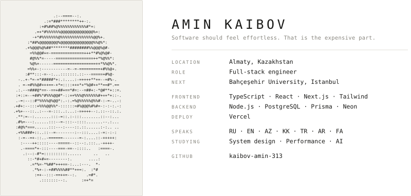

<picture>
  <source media="(prefers-color-scheme: dark)" srcset="header-dark.svg">
  
</picture>

### Selected work

**BASHIR&CO** — luxury sourcing brand, six-page cinematic SPA.
The interesting problem was motion continuity: GSAP timelines that survive route
changes without leaking, so navigation feels like one camera move instead of six pages.
`TypeScript` `Next.js` `GSAP` `Tailwind`

**AUA** — hyperlocal air quality for Almaty.
Official monitoring stations leave large blind zones between them. The platform
interpolates coverage across the gaps, flags readings that disagree with the
official post, and answers the one question a parent actually asks: can my kid
go outside right now.
`React` `TypeScript` `Leaflet` `Vite`

**Ahlul al-Bayt** — multilingual educational platform.
Prayer times, duas, ziyarat, audio lectures, Q&A. The hard part is typographic:
Russian, Arabic and Persian sharing one layout, each set correctly, RTL included.
`Next.js` `PostgreSQL` `Prisma`

### How I work

Motion has to earn its place. If an animation doesn't help you understand what
just happened, it comes out.

One considered screen beats five rough ones. I would rather ship less and have
it hold up.

Code should still make sense in six months, to someone who isn't me.

### Colophon

Portrait rendered as ASCII, 46 columns, from a single photograph.
Set in the system monospace stack throughout.
Built by hand. Revised 2026.07.

---

[github.com/kaibov-amin-313](https://github.com/kaibov-amin-313)
